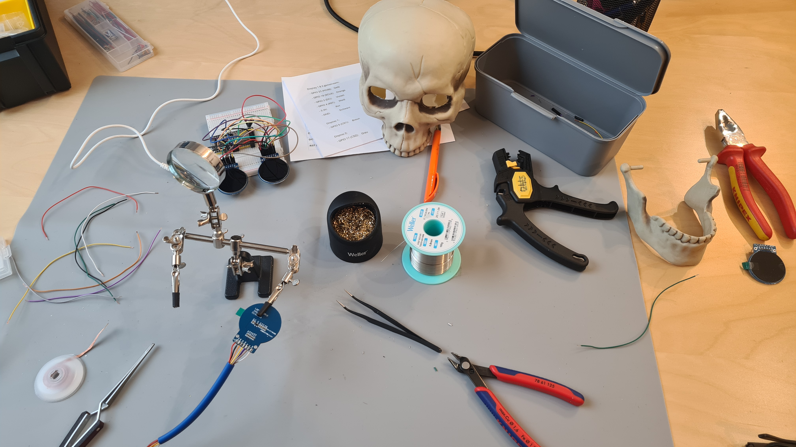

# Master the Round display on ESP32 and GC9A01 driver with the TFT_eSPI library. 

### Youtube Tutorial
https://youtu.be/pmCc7z_Mi8I

### Original source code
https://github.com/thelastoutpostworkshop/ESP32LCDRound240x240Eyes


---

## Configuration Guide: ESP32-WROOM-32 with GC9A01 Round Display(s)




### Hardware Requirements
- **Microcontroller**: ESP32-WROOM-32 (original ESP32, NOT ESP32-S3)
- **Display(s)**: 1.28" GC9A01 Round Display(s) 240x240px
- **Display Driver IC**: GC9A01
- **Quantity**: 1 or 2 displays

### Step 1: Configure TFT_eSPI Library

Edit the file: `Documents/Arduino/libraries/TFT_eSPI/User_Setup.h`

**Find and modify these GPIO pin definitions:**

```cpp
// For ESP32 Dev board (only tested with GC9A01 display)
// The hardware SPI can be mapped to any pins

#define TFT_MOSI 23  // In some display driver board, it might be written as "SDA"
#define TFT_SCLK 18
#define TFT_CS   15  // Chip select control pin
#define TFT_DC   2   // Data Command control pin
#define TFT_RST  4   // Reset pin
//#define TFT_BL  21  // LED back-light (commented out if display has no backlight)
```

**Important**: Ensure the display driver is selected:
```cpp
#define GC9A01_DRIVER
```

### Step 2: Configure Project Settings in config.h

#### For Single Display:

```cpp
#define TFT_COUNT 1        // Number of screens
#define TFT1_CS -1         // Use TFT_eSPI setup (no separate pin needed)
#define TFT_1_ROT 2        // Rotation: 0-3 (adjust as needed)

#define NUM_EYES 1         // Number of eyes to display

#define EYE_1_XPOSITION 50 // Horizontal offset for centering
```

#### For Dual Displays (Left and Right Eyes):

```cpp
#define TFT_COUNT 2        // Number of screens
#define TFT1_CS 5          // Left eye chip select
#define TFT2_CS 17         // Right eye chip select
#define TFT_1_ROT 2        // Left eye rotation
#define TFT_2_ROT 2        // Right eye rotation

#define NUM_EYES 2         // Number of eyes to display

#define EYE_1_XPOSITION 50 // Left eye horizontal offset
#define EYE_2_XPOSITION 50 // Right eye horizontal offset
```

### Step 3: Select Eye Style

In `config.h`, uncomment ONE of the eye styles:

```cpp
#include "data/defaultEye.h"      // Standard human-ish hazel eye
// #include "data/dragonEye.h"     // Slit pupil fiery dragon/demon eye
// #include "data/noScleraEye.h"   // Large iris, no sclera
// #include "data/goatEye.h"       // Horizontal pupil goat/Krampus eye
// #include "data/newtEye.h"       // Eye of newt
// #include "data/terminatorEye.h" // Terminator eye
// #include "data/catEye.h"        // Cartoonish cat eye
// #include "data/owlEye.h"        // Minerva the owl (DISABLE TRACKING)
// #include "data/naugaEye.h"      // Nauga googly eye (DISABLE TRACKING)
// #include "data/doeEye.h"        // Cartoon deer eye (DISABLE TRACKING)
```

### GPIO Pinout Reference

#### ESP32-WROOM-32 Pins Used:

| Function | GPIO | Wire Color | Notes |
|----------|------|-----------|-------|
| MOSI (SDA) | 23 | Yellow | Shared between displays |
| SCLK (SCL) | 18 | Orange | Shared between displays |
| DC | 2 | Violet | Shared between displays |
| RST | 4 | White | Shared between displays |
| **CS1 (Left Eye)** | **5** | **Brown** | Single display only |
| **CS2 (Right Eye)** | **17** | **Gray** | Dual display setup |
| VCC | 3.3V | Red | Power supply |
| GND | GND | Black | Ground |

#### Wiring Diagram (Dual Display):

**Both Displays Connected:**
- Display 1 SCLK → GPIO 18 (Orange)
- Display 1 SDA → GPIO 23 (Yellow)
- Display 1 DC → GPIO 2 (Violet)
- Display 1 RST → GPIO 4 (White)
- Display 1 CS → GPIO 5 (Brown)
- Display 1 VCC → 3.3V (Red)
- Display 1 GND → GND (Black)

- Display 2 SCLK → GPIO 18 (Orange)
- Display 2 SDA → GPIO 23 (Yellow)
- Display 2 DC → GPIO 2 (Violet)
- Display 2 RST → GPIO 4 (White)
- Display 2 CS → GPIO 17 (Gray)
- Display 2 VCC → 3.3V (Red)
- Display 2 GND → GND (Black)

### Troubleshooting

**Error: Guru Meditation Error / StoreProhibited**
- Verify all GPIO pins are valid for ESP32-WROOM-32
- Ensure GPIO 22 and 23 are NOT used together as backlight
- Check that CS pins (5, 17) are correctly set for dual display

**Display Not Showing**
- Verify TFT_eSPI has `GC9A01_DRIVER` enabled
- Check all wiring connections
- Try different rotation values (0-3) in `TFT_1_ROT` / `TFT_2_ROT`

**Eyes Appear Upside Down or Sideways**
- Adjust `TFT_1_ROT` and `TFT_2_ROT` values (0, 1, 2, or 3)
- Modify `EYE_1_XPOSITION` and `EYE_2_XPOSITION` for centering

### Arduino IDE Board Selection

Ensure you have selected:
- **Board**: ESP32 Dev Module (or similar ESP32-WROOM-32)
- **Flash Mode**: DIO
- **Flash Size**: 4MB
- **CPU Frequency**: 240MHz

